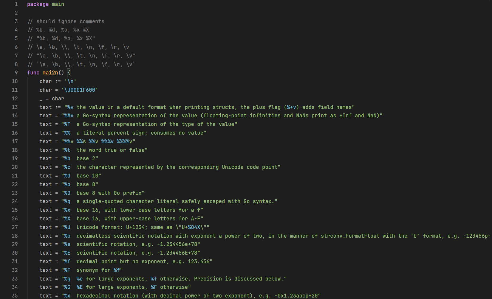
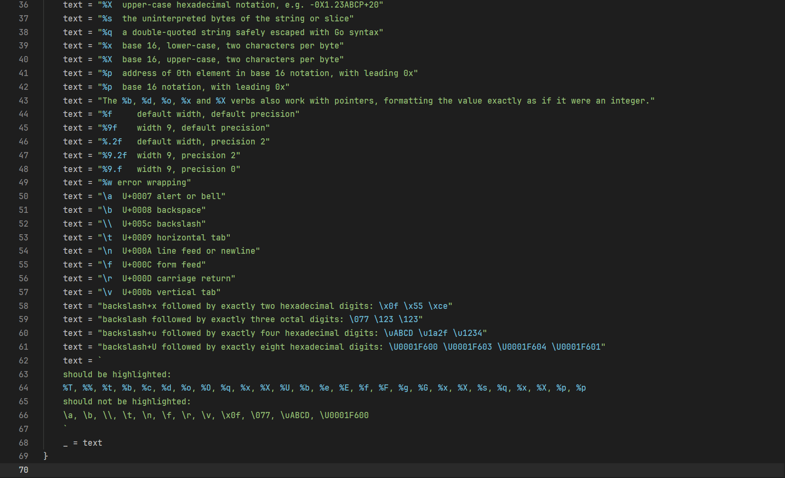

# Go Strings Highlight

## Features
Highlights placeholders and escape sequences in go string literals.




## Extension Settings
```json
"go-strings-highlight.colors": {
    "escapeSequenceColor": "#71bbd2",
    "placeholderColor": "#71bbd2",
}
```

## Release Notes
### 1.0.0
initial release
